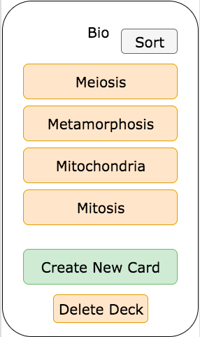

# Session Cards

### Background

Session Cards is a flashcards mobile application built with React Native with which users can use to create flashcards and store them in decks that they can view later. React Native will be used to create the frontend user interface and a sqlite3 database will be used to store all flashcards and decks that the user creates.

### Functionality & MVP

With Session Cards, users will be able to:

-[ ] Create new flashcards
-[ ] Create decks out of flashcards
-[ ] Store flashcards and decks for later viewing
-[ ] Delete flashcards and decks that the user no longer wants

In addition, this project will include:

-[ ] A production README

### Wireframes

The decks index page and the user's home page.

The cards index page and the single deck page.

The view of a single card. The swipe functionality will be added here.

The form for creating a new flashcard.

### Architecture and Technologies

This project will be implemented with the following technologies:

-React Native
-Sqlite3 database
-Webpack to bundle and serve up the various scripts.

The architecture of the project will be as follows:
-Card class - This will be responsible for storing all the text data of a card. This will belong to a deck.
-Deck class - This will have many Cards.
-CreateCards - This will be responsible for creating new cards, possible through the use of Redux cycles.
-Redux cycle for fetching, creating, and destroying cards and decks

Some of the technical difficulties that I foresee right now are 1) whether or not each user gets their own database or if there will have to be one central database and 2) how to deploy the MVP product.

### Implementation Timeline

**Day 1**: Research more into React Native and look into solutions of the database problem. Then set up the database for the Card class and the Deck class.

**Day 2**: Test all validations and associations for Card and Deck. Set up basic renderings of the Card and Deck on the frontend.

**Day 3**: Finish up rendering the Decks and Cards. Create a new deck and card form. Set up the necessary API for creating new cards and decks.

**Day 4**: Render the creation forms. Style all components.

**Day 5**: Get all interactivity such as swiping and scrolling set up and ready to go.
